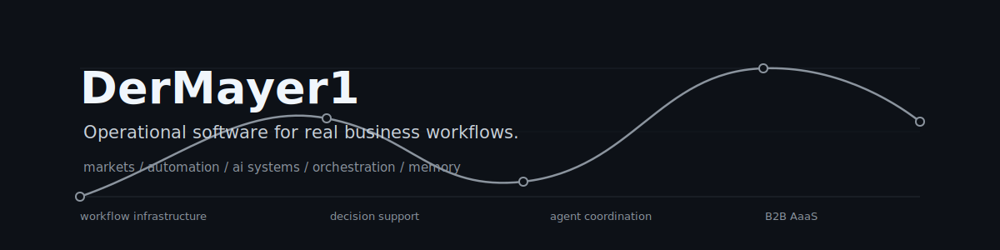
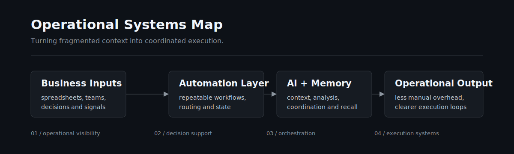

<p align="center">
  
</p>

## About

I didn’t come into software through the traditional path.

Automating spreadsheets and operational workflows with Python quietly escalated into building full systems. Freelancing accelerated that process because I kept running into the same problem across different businesses: operational chaos.

Fragmented workflows, repetitive decisions, disconnected context, dashboards nobody wanted to open, and processes held together by spreadsheets and human memory.

That pushed me toward operational software, workflow systems and orchestration tooling.

I spend most of my time building around:

- operational systems
- operational tooling
- workflow infrastructure
- decision-support systems
- memory and context infrastructure
- internal software
- B2B AaaS

The more I work around AI systems, the less interested I become in demo-driven products. I’m more interested in software that becomes part of the operational layer itself: coordinating workflows, centralizing context, reducing manual overhead and making businesses more functional behind the scenes.

## Current Systems

| System | Direction |
| --- | --- |
| **ClerkOS** | Operational workspace built around local-first agents, persistent memory, workflow coordination and long-running tasks. |
| **SkytOffer** | Strategic and operational system for digital launch operations, visibility, analysis and centralized decision-support. |
| **AlturionX** | Operational tooling focused on workflow systems, business intelligence and orchestration logic. |

## Systems Philosophy

Most companies don’t suffer from lack of software. They suffer from fragmented workflows, disconnected context, repetitive decisions, dashboard sprawl, information latency and systems nobody wants to maintain.

That’s the layer I keep gravitating toward.

<p align="center">
  
</p>

## Operational Interests

```text
CURRENT FOCUS
────────────────────────────
AI operational systems

CURRENT DIRECTION
────────────────────────────
orchestration
workflow infrastructure
memory/context systems
decision-support tooling

CURRENT PROBLEM
────────────────────────────
most businesses still run on spreadsheet infrastructure

CURRENT OBSESSION
────────────────────────────
systems that quietly remove operational friction
```

## Activity

<p align="center">
  
</p>

## Notes

I occasionally write and think about operational software, workflow infrastructure, AaaS, decision-support systems, agent coordination and why most companies are still one spreadsheet away from operational collapse.

## Tech Stack

### AI and Agents

<p>
  
  
  
  
</p>

### Product Systems

<p>
  
  
  
  
</p>

### Infrastructure

<p>
  
  
  
  
  
</p>

<p align="center">
  <sub>Python made the spreadsheets dangerous. TypeScript made it a career problem.</sub>
</p>
