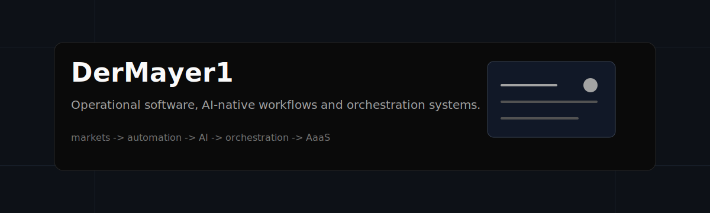

<p align="center">
  
</p>

<p align="center">
  
</p>

---

# About

I didn’t come into software through the traditional path.

At some point, automating spreadsheets and operational workflows with Python quietly escalated into building full systems. Freelancing accelerated that process even further, mostly because I kept running into the same problem across different businesses:

Operational chaos.

Fragmented workflows, repetitive decisions, disconnected context, dashboards nobody wanted to open, processes held together by spreadsheets and human memory.

That naturally pushed me toward operational software, orchestration systems and AI-native infrastructure.

Today I spend most of my time building systems around:

- AI-native workflows
- operational tooling
- orchestration layers
- decision-support systems
- memory/context infrastructure
- internal software
- B2B AaaS

The more I work around AI systems, the less interested I become in demo-driven products and the more interested I become in operational depth.

Most AI products feel theatrical.

I’m far more interested in systems where AI becomes part of the operational layer itself: coordinating workflows, centralizing context, reducing manual overhead and quietly making businesses more functional behind the scenes.

---

# Current Systems

## ClerkOS

AI-native operational workspace built around:

- local-first agents
- orchestration layers
- persistent memory
- workflow coordination
- AI-assisted operational execution
- long-running tasks

---

## SkytOffer

AI-assisted strategic and operational system originally designed around digital launch operations, workflow centralization and decision-support.

Focused heavily on:

- operational visibility
- AI-assisted analysis
- workflow simplification
- centralized strategic context

---

## AlturionX

Operational tooling and AI-native systems focused on:

- workflow infrastructure
- operational processes
- business intelligence
- orchestration logic
- decision-support systems

---

# Systems Philosophy

Most companies don’t actually suffer from lack of software.

They suffer from:

- fragmented workflows
- disconnected operational context
- repetitive decision-making
- dashboard sprawl
- process complexity disguised as management
- information latency
- systems nobody wants to maintain

That’s the layer I keep gravitating toward.

---

# Infrastructure Map

<p align="center">
  
</p>

---

# AI & Orchestration

<p align="left">
  
</p>

<p align="left">
  
  
  
  
  
  
</p>

---

# Product Systems

<p align="left">
  
</p>

---

# Operational Interests

```bash
> current_focus

AI-native operational systems

> current_direction

orchestration layers
workflow infrastructure
memory/context systems
decision-support tooling
B2B AaaS

> current_problem

most businesses still run on spreadsheet infrastructure

> current_obsession

systems that quietly remove operational friction
```

---

# Activity

<p align="center">
  
</p>

---

# Notes

I occasionally write and think about:

- AI-native systems
- orchestration layers
- operational software
- workflow infrastructure
- AaaS
- decision-support systems
- agent coordination
- why most companies are still one spreadsheet away from operational collapse

---

<p align="center">
  <sub>
    Python made the spreadsheets dangerous. TypeScript made it a career problem.
  </sub>
</p>
